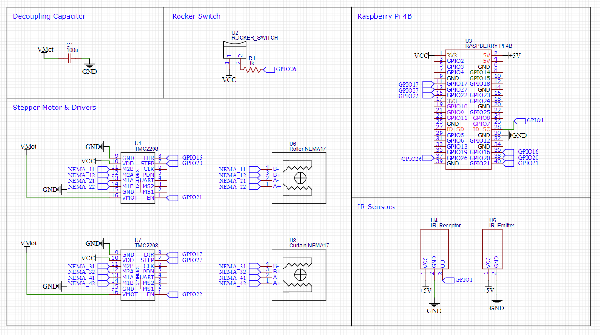

# ConveyorBeltProject 

### [Software](#software)
 - [RPI Details](#rpi-details)
 - [Accessing the RPI through SSH](#accessing-the-rpi-through-ssh)

### [Electrical Hardware](#electrical-hardware)
 - [Schematic](#schematic)
 - [Assembly Notes](#assembly-notes)
 - [Setting the TMC2208 Current Limit](#setting-the-tmc2208-current-limit)

### [Github Sync](#github-sync)
 - [Repo From New Folder](#repo-from-new-folder)
 - [Update Current Folder](#update-current-folder)

### [Resources](#resources)

#

# Software
There are no requirements, as the time and RPi library should have been installed. However, the `TMC_Stepper.py` file should be downloaded and put in the same directory as `new_stepper.py`.

## RPI Details
    Username: pi
    Password: raspberry

## Accessing the RPI through SSH
Connect to Stuck Wifi and type the following in command line. Putty, a free SSH client can be used as well. After that type in the Pi's username and password. Note that the IP address below is unique to the WiFi that it is conencted to. Hence, when the RPI is connected to a different wifi network, it cannot connect using this IP address.
    
    ssh pi@10.0.4.88 

# Electrical Hardware

## Schematic

## Assembly Notes
- The **Decoupling Capcaitor** is recomended across the motor power supply to protect the driver boar from voltage spikes. The electrolytic capcitor must have a voltage higher than the power supply(12.1V), with at least 45uF capacity
- The **IR sensors** can operate with both 5V and 3.3V logic level. 5V is recomened to give the IR emitter sufficient range to hit the IR reciever. The pin connected to the IR reciever should be initialised as `input pull-up`. (Refer to code)
- Before assembling the schematic, you MUST **set the current limit of the TMC2208**. This is explained in the next section.

## Setting the TMC2208 Current Limit
Setting the current limit is important to ensure that the current flowing into the NEMA17 is not too high. This should be between 1.5A to 1.8A [[source]](https://reprap.org/wiki/NEMA_17_Stepper_motor#:~:text=1.5A%20to%201.8A%20current%20per%20phase).

1. Power the driver with the voltage source of the motor on the VMOT and GND pins. Do not connect the motor.
2. Measure the reference voltage with one probe on GND and other on the whole right next to the enable pin.
3. The current limit is the votlage referenced voltage observed multipled by 0.71.

***Current Limit = Vref x 0.71***

# Github Sync
I could not get the Raspberry Pi to push to the repo, as I could not give it permissions. Hence, there is no way to merge changes. I would simply edit it and push through my computer and pull through the Raspberry Pi.

## Repo From New Folder

    mkdir ConveyorBeltProject
    cd ConveyorBeltProject
    git init
    git branch -M main #rename current branch to main
    git remote add origin https://github.com/flamerten/ConveyorBeltProject
    git pull origin main

## Update Current Folder
Note: Assumes that Git is initialised

    cd ConveyorBeltProject
    git reset --hard #remove previous changes
    git pull origin main

# Resources 
https://howtomechatronics.com/tutorials/arduino/stepper-motors-and-arduino-the-ultimate-guide/

note that the step duration is 10x of the example code given in the resource above, as the resource is using an Arduino but we are using an RPI.
